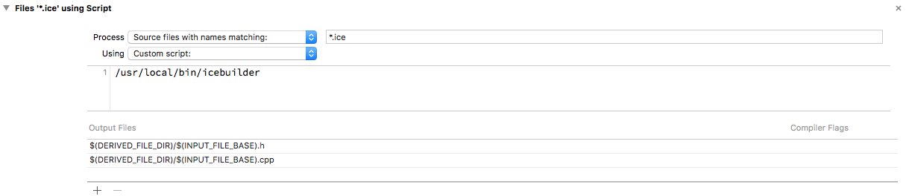

# Ice Builder for Xcode

Ice Builder for Xcode is a command line program to help compile Slice files to C++ or Objective-C in Xcode. It supports
recent versions of Xcode, including Xcode 8 and Xcode 7.

___Note:___ Ice Builder for Xcode has been changed from an Xcode plug-in to a command line program due to recent
Xcode developments. If you are using Xcode 7, you can still use the [Ice Builder for Xcode plug-in][1].

## Install

### Homebrew

You can install Ice Builder for Xcode using Homebrew by running the following commands:

    brew tap zeroc-ice/tap
    brew install ice-builder-xcode

### Manually

Download [icebuilder](icebuilder) to any path on your system. For example: `/usr/local/bin/icebuilder`.

## Usage

### Options

| Option        | Description                                     |
| :-----------: | ----------------------------------------------- |
| --cpp         | Use `slice2cpp`. Default is `slice2objc`.       |
| -h, --help    | Print usage message.                            |
| -v, --version | Display Ice Builder for Xcode version.          |
| -- ARGS       | Arguments passed directly to the slice compiler.|

Refer to the [slice2cpp][2] and [slice2objc][3] _Command Line Options_ documention for a description of the options you can
provide through the args property.

### Xcode Build Rule

To use Ice Builder for Xcode you must create a custom build rule in your Xcode project. The following settings are a
good starting point; however, you may need to modify them depending on your project's needs.

* __Process__: `*.ice`
* __Using__: _Custom script_

    ```
    /usr/local/bin/icebuilder [options]
    ```
* __Output Files__:
    * `$(DERIVED_FILE_DIR)/$(INPUT_FILE_BASE).h`
    * `$(DERIVED_FILE_DIR)/$(INPUT_FILE_BASE).cpp` (For a C++ project)
    * `$(DERIVED_FILE_DIR)/$(INPUT_FILE_BASE).m` (For an Objective-C project)



### Xcode Build Settings

For Cocoa and iPhone applications, which use the IceTouch or Ice Xcode SDKs, you
must add the appropriate directory to the `Additional SDKs` setting:

| Distribution  | Language          | Location                                                           |
| ------------- | ----------------- | ------------------------------------------------------------------ |
| Ice Touch 3.6 | Objective-C       | `/usr/local/lib/IceTouch/ObjC/$(PLATFORM_NAME).sdk`                |
| Ice Touch 3.6 | C++               | `/usr/local/lib/IceTouch/Cpp/$(PLATFORM_NAME).sdk`                 |
| Ice 3.7       | Objective-C       | `/usr/local/lib/IceSDK/$(PLATFORM_NAME).sdk`                       |
| Ice 3.7       | C++               | `/usr/local/lib/IceSDK/$(PLATFORM_NAME).sdk`                       |

You also need to add the following linker options to the `Other Linker Flags` setting:

| Distribution | Language    | Required                    | Ice Plugins                                                                                               | Optional Services                                        |
| ------------ | --------    | --------------------------- | ----------------------------------------------------------------------------------------------------------| -------------------------------------------------------- |
| All          | All         | `-liconv` `-lbz2` `-lc++`   |                                                                                                           |                                                          |
| Ice Touch    | Objective-C | `-ObjC` `-lIceObjC`         |                                                                                                           | `-lGlacier2ObjC`<br>`-lIceStormObjC`<br>`-lIceGridObjC`  |
| Ice Touch    | C++         | `-lIce`                     |                                                                                                           | `-lGlacier2`<br>`-lIceGrid`<br>`-lIceStorm`              |
| Ice 3.7      | Objective-C | `-ObjC` `-lIce` `-lIceObjC` | `-lIceDiscovery`<br> `-lIceIAP` `-lIceIAPObjC`<br>  `-lIceLocatorDiscovery`<br> `-lIceSSL` `-lIceSSLObjC` | `-lGlacier2ObjC`<br>`-lIceGridObjC`<br> `-lIceStormObjC` |
| Ice 3.7      | C++         | `-lIce`                     | `-lIceDiscovery`<br> `-lIceIAP`<br> `-lIceLocatorDiscovery`<br> `-lIceSSL`                                | `-lGlacier2`<br>`-lIceGrid`<br> `-lIceStorm`             |

You must also link with the following Frameworks:
* `Security.framework` (Ice Touch all the time, Ice when linking with IceSSL)
* `CFNetwork.framework` (iOS)
* `UIKit.framework` (iOS)
* `ExternalAccessory.framework` (iOS when linking with IceIAP)

### Generating Code using Xcode

The builder will always compile a Slice file when executed by an Xcode custom build rule; however, Xcode custom build
rules are only executed when either the given `Output Files` do not exist or are older than the file being processed.
To force your Slice files to be re-compiled you need to clean (⇧⌘K) your project, then build (⌘B).

The builder automatically includes the Ice Slice files directory included with the Ice or Ice Touch SDK as well as the
directory of the Slice file being compiled.

[1]: https://github.com/zeroc-ice/ice-builder-xcode/tree/xcode7-plugin
[2]: https://doc.zeroc.com/display/Ice/slice2cpp+Command-Line+Options
[3]: https://doc.zeroc.com/display/Ice/slice2objc+Command-Line+Options
