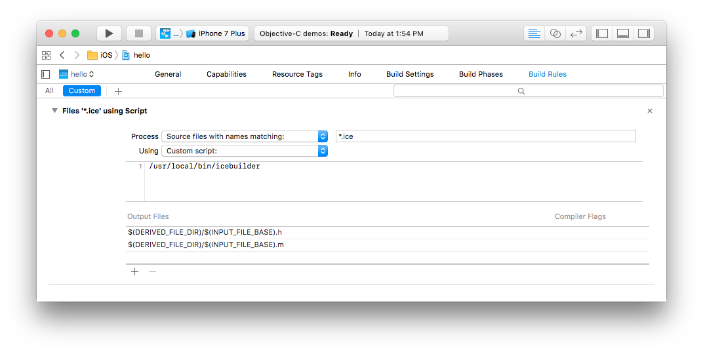

# Ice Builder for Xcode

Ice Builder for Xcode is a command line program to help compile Slice files to
C++ or Objective-C in Xcode. It supports all recent versions of Xcode, including
Xcode 8.

## Install

### Homebrew

Install Ice Builder for Xcode using Homebrew by running the following commands:
```
brew install zeroc-ice/tap/ice-builder-xcode
```
### Manually

Download the [icebuilder](icebuilder) shell script to any path on your system.
For example: `/usr/local/bin/icebuilder`.

## Usage

### Options

| Option          | Description                                     |
| --------------- | ----------------------------------------------- |
| --ice-home HOME | Set the Ice home directory.                     |
| --cpp           | Use `slice2cpp` instead of `slice2objc`.        |
| -h, --help      | Print usage message.                            |
| -v, --version   | Display the version of Ice Builder.             |
| -- ARGS         | Arguments passed directly to the Slice compiler.|

If you do not set the Ice home directory with `--ice-home`, the builder  first
scans the `Additional SDKs` of your project, and attempts to find its `Ice home`
in SDKs with `IceTouch` or `IceSDK` in their path.

If there is no such SDK, the builder uses `/usr/local` as its Ice home
directory.

Refer to the [slice2cpp][1] and [slice2objc][2] _Command Line Options_
documentation for a description of the options you can provide through `ARGS`.
You could for example invoke the builder with:
```
icebuilder --cpp -- -DFOO=1 --checksum
```

The builder automatically adds the following include directories to the
Slice compilation:
 * the Ice Slice files directory provided by `Ice home`
 * the directory of the Slice file being compiled

### Xcode Build Rule

To use Ice Builder for Xcode, you must create a custom build rule in your
Xcode project. For example:

* __Process__ `Source files with names matching:` `*.ice`
* __Using__ `Custom script:`

    ```
    /usr/local/bin/icebuilder [options]
    ```
* __Output Files__:
    * `$(DERIVED_FILE_DIR)/$(INPUT_FILE_BASE).h`
    * `$(DERIVED_FILE_DIR)/$(INPUT_FILE_BASE).cpp` (For a C++ project)
    * `$(DERIVED_FILE_DIR)/$(INPUT_FILE_BASE).m` (For an Objective-C project)



The wildcard `*.ice` means Xcode will execute your custom script for each Slice
file.

The `Output Files` must list exactly two files: the header file and the
C++ or Objective-C implementation file generated by the Slice compiler.
These two files must be in the same directory: the builder sets `--output-dir`
to this directory when it calls the Slice compiler.

### Xcode Build Settings

#### Ice 3.7
The Xcode build settings are described in the [Ice 3.7 Release Notes][3].

#### Ice Touch

For Cocoa and iPhone applications, which use the Ice Touch SDKs, you must add the 
appropriate directory to the `Additional SDKs` setting:

| Distribution  | Language          | Location                                                           |
| ------------- | ----------------- | ------------------------------------------------------------------ |
| Ice Touch 1.3 | Objective-C       | `/Library/Developer/IceTouch-1.3/SDKs/ObjC/$(PLATFORM_NAME).sdk`   |
| Ice Touch 1.3 | C++               | `/Library/Developer/IceTouch-1.3/SDKs/Cpp/$(PLATFORM_NAME).sdk`    |
| Ice Touch 3.6 | Objective-C       | `/usr/local/lib/IceTouch/ObjC/$(PLATFORM_NAME).sdk`                |
| Ice Touch 3.6 | C++               | `/usr/local/lib/IceTouch/Cpp/$(PLATFORM_NAME).sdk`                 |

You also need to add the following linker options to the `Other Linker Flags` setting:

| Distribution  | Language    | Required                                     | Ice Plugins                                                                                                | Optional Services                                                            |
| ------------  | ----------- | -----------------------------------          | ---------------------------------------------------------------------------------------------------------- | ---------------------------------------------------------------------------- |
| Ice Touch 1.3 | Objective-C | `-ObjC`<br>`-lIceObjC-libc++`<br>`-lc++`     | included in the<br>IceObjC-libc++ library                                                                     | `-lGlacier2ObjC-libc++`<br>`-lIceStormObjC-libc++`<br>`-lIceGridObjC-libc++` |
| Ice Touch 1.3 | C++         | `-lIceCpp-libc++`                            | included in the<br>IceCpp-libc++ library                                                                      | `-lGlacier2Cpp-libc++`<br>`-lIceGridCpp-libc++`<br>`-lIceStormCpp-libc++`    |
| Ice Touch 3.6 | Objective-C | `-ObjC`<br>`-lIceObjC`<br>`-lc++`            | included in the<br>IceObjC library                                                                            | `-lGlacier2ObjC`<br>`-lIceStormObjC`<br>`-lIceGridObjC`                      |
| Ice Touch 3.6 | C++         | `-lIce`                                      | included in the<br>Ice library                                                                                | `-lGlacier2`<br>`-lIceGrid`<br>`-lIceStorm`                                  |

On macOS, you also need to add `-lbz2` and `-liconv`.

You must also link with the following Frameworks:
* `Security.framework`
* `CFNetwork.framework` (iOS)
* `UIKit.framework` (iOS)

### Generating Code using Xcode

The builder will always compile a Slice file when executed by an Xcode custom
build rule; however, Xcode custom build rules are only executed when either the
given `Output Files` do not exist or are older than the file being processed.
To force your Slice files to be re-compiled you need to clean (⇧⌘K) your
project, then build (⌘B).

[1]: https://doc.zeroc.com/display/Ice/slice2cpp+Command-Line+Options
[2]: https://doc.zeroc.com/display/Ice/slice2objc+Command-Line+Options
[3]: https://doc.zeroc.com/display/Ice37/Using+the+macOS+Binary+Distribution
